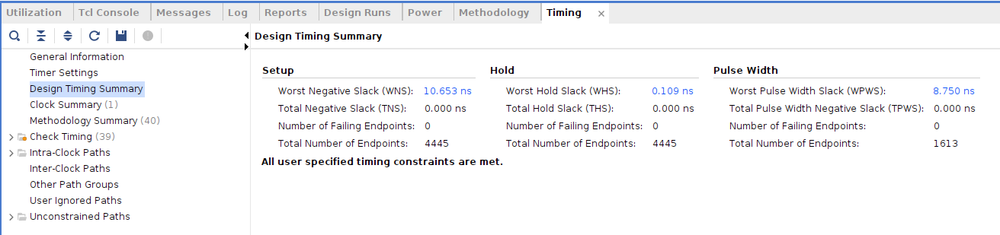
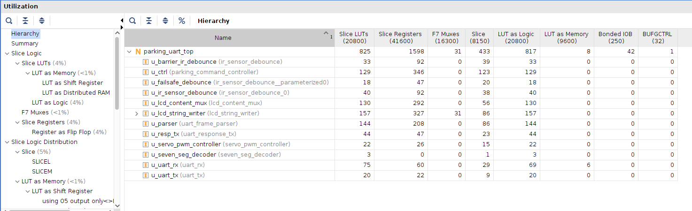
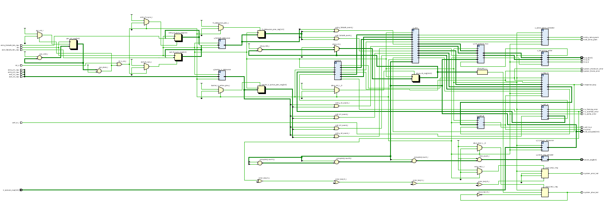
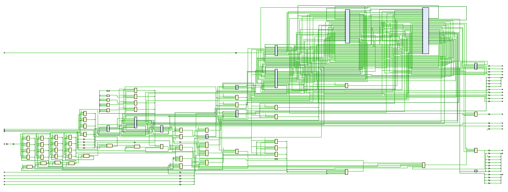
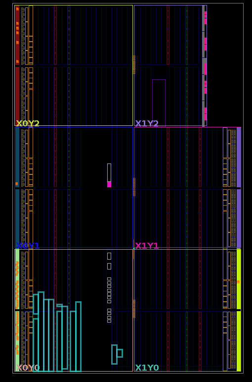

# FPGA — RTL Parking Controller

Hand-written Verilog RTL for the smart-parking gate controller: a framed UART link, a command-dispatch FSM, servo PWM, IR-sensor debounce, and LCD + 7-segment display drivers — fully simulated and implemented on a Xilinx Artix-7.

- **Target board:** MicroPhase Artyx A7 Lite 35T
- **FPGA:** Xilinx **Artix-7 XC7A35T**
- **System clock:** 50 MHz (20 ns), LVCMOS33 I/O
- **Toolchain:** Vivado (synthesis & implementation), Questa/ModelSim (local sim + waveforms), Icarus Verilog (CI)

> See the [top-level README](../README.md) for the full system (FPGA + ESP32 + AI server) and the [waveform gallery](../docs/waveform/README.md) for per-module simulation captures.

---

## Directory Layout

```text
FPGA/
├── rtl/            # 12 Verilog RTL modules
├── tb/             # 12 SystemVerilog self-checking testbenches
├── scripts/        # Makefile + wave.do (Questa)
└── constraints/    # parking_uart_top.xdc (Vivado pin mapping)
```

---

## RTL Modules

| Module | Role |
|--------|------|
| `uart_rx` | UART receiver — 16× oversampling, FIFO, parity/framing/overflow flags, glitch rejection |
| `uart_tx` | UART transmitter — 8N1, LSB-first, 115200 baud |
| `uart_frame_parser` | Decodes `[0xAA \| CMD \| LEN \| PAYLOAD \| XOR]`, checksum + frame-timeout |
| `uart_response_tx` | Builds/serializes ACK/NACK/event frames back to the host |
| `parking_command_controller` | Main FSM — gate dispatch, slot accounting, IR + failsafe handling, LCD messages |
| `servo_pwm_controller` | 50 Hz PWM for entry/exit gate servos |
| `ir_sensor_debounce` | 2-stage synchronizer + majority debounce (reused for slot / barrier / button inputs) |
| `lcd_hd44780` | HD44780 4-bit LCD driver |
| `lcd_string_writer` | Sequential 16-char line writer |
| `lcd_content_mux` | Display content selector with message hold timer |
| `seven_seg_decoder` | BCD → 7-segment decode of free-slot count |
| `parking_uart_top` | Top-level integration + power-on reset + alive/error LEDs |

---

## Simulation

```bash
cd scripts

make sim  TOP=tb_parking_uart_top   # batch run a testbench
make wave TOP=tb_parking_uart_top   # open the Questa waveform viewer
```

Every module has a dedicated self-checking testbench in `tb/`. **Full functional sign-off is done in Questa/ModelSim** — the [waveform gallery](../docs/waveform/README.md) is the record of that. CI additionally smoke-tests the subset of testbenches that are portable to the open-source Icarus Verilog (a few use SystemVerilog features Icarus doesn't support).

---

## Implementation Results

Synthesized, placed & routed in Vivado for the **XC7A35T** at 50 MHz. The design **meets all timing constraints with positive slack and zero failing endpoints**.

### Timing summary

| | Value |
|---|---|
| Worst Negative Slack (WNS) | **+10.653 ns** |
| Worst Hold Slack (WHS) | +0.109 ns |
| Worst Pulse Width Slack (WPWS) | +8.750 ns |
| Failing endpoints | **0 / 4,445** |
| Max achievable clock | **≈ 107 MHz** (implied by positive slack at 50 MHz) |
| Result | ✅ *All user-specified timing constraints are met* |



### Resource utilization

| Resource | Used | Available | % |
|----------|------|-----------|---|
| Slice LUTs | 825 | 20,800 | ~4% |
| &nbsp;&nbsp;– LUT as Logic | 817 | 20,800 | ~4% |
| &nbsp;&nbsp;– LUT as Memory | 8 | 9,600 | <1% |
| Slice Registers (FF) | 1,598 | 41,600 | ~4% |
| F7 Muxes | 31 | 16,300 | <1% |
| Occupied Slices | 433 | 8,150 | ~5% |
| Bonded IOB | 42 | 250 | ~17% |
| BUFGCTRL | 1 | 32 | ~3% |

**Per-module breakdown (LUT / FF):**

| Module | LUTs | FFs |
|--------|------|-----|
| `lcd_string_writer` | 157 | 327 |
| `uart_frame_parser` | 144 | 208 |
| `lcd_content_mux` | 130 | 292 |
| `parking_command_controller` | 129 | 346 |
| `uart_rx` | 75 | 60 |
| `uart_response_tx` | 44 | 47 |
| `ir_sensor_debounce` (slot) | 40 | 92 |
| `ir_sensor_debounce` (barrier) | 33 | 92 |
| `servo_pwm_controller` | 22 | 26 |
| `uart_tx` | 20 | 22 |
| `failsafe_debounce` | 18 | 47 |
| `seven_seg_decoder` | 3 | 0 |



### RTL schematic (module hierarchy)



### Synthesized schematic



### Placed & routed device view (XC7A35T)



---

## Pin Constraints

All top-level I/O is mapped to documented board pins in [`constraints/parking_uart_top.xdc`](constraints/parking_uart_top.xdc): 50 MHz clock on `J19`, active-low reset on `KEY1`, UART / IR sensors / servos / failsafe buttons / status LEDs on `JP1`, and the HD44780 LCD on `JP2`. All I/O is LVCMOS33.
