<div align="center">

# 🅿️ Smart Parking — FPGA + AI

**A full-stack embedded parking system: RTL gate controller on FPGA, ESP32 WiFi gateway, and an AI license-plate-recognition server.**

Hand-written SystemVerilog/Verilog RTL drives the gates, sensors and displays; an ESP32 bridges UART to WiFi; a Flask + YOLOv8 + CRNN server reads plates and logs everything to Firebase in real time.

[](https://github.com/vohoangnguyennnn/smart-parking-fpga-AI/actions/workflows/fpga-rtl-ci.yml)
[](https://github.com/vohoangnguyennnn/smart-parking-fpga-AI/actions/workflows/esp32-ci.yml)


</div>

---

## 📑 Table of Contents

- [Overview](#-overview)
- [System Architecture](#-system-architecture)
- [End-to-End Flow](#-end-to-end-flow)
- [FPGA — RTL Design](#-fpga--rtl-design)
- [UART Command Protocol](#-uart-command-protocol)
- [Simulation & Verification](#-simulation--verification)
- [ESP32 Gateway & Camera](#-esp32-gateway--camera)
- [AI Server](#-ai-server)
- [Repository Structure](#-repository-structure)
- [Getting Started](#-getting-started)
- [Continuous Integration](#-continuous-integration)
- [Tech Stack](#-tech-stack)
- [License](#-license)

---

## 🎯 Overview

This project implements a complete, hardware-in-the-loop **automated parking barrier system**, split into three cooperating subsystems:

| Layer | What it does | Tech |
|-------|--------------|------|
| **FPGA (RTL)** | Real-time gate control, servo PWM, IR-sensor debounce, LCD + 7-segment display, framed UART link. **All logic hand-written and simulated at RTL.** | Verilog / SystemVerilog, Questa, Icarus Verilog, Vivado |
| **ESP32 Gateway** | Bridges the FPGA UART link to WiFi, drives the ESP32-CAM, and talks HTTP/JSON to the AI server. | C++ / PlatformIO / FreeRTOS |
| **AI Server** | Detects and reads license plates (YOLOv8 + CRNN OCR), enforces entry/exit rules, and logs to Firebase. | Python, Flask, PyTorch, Ultralytics |

The headline of the project is the **FPGA RTL design**: a 12-module datapath with a framed UART protocol, a command-dispatch FSM, and **12 self-checking testbenches**, every one captured as a Questa waveform.

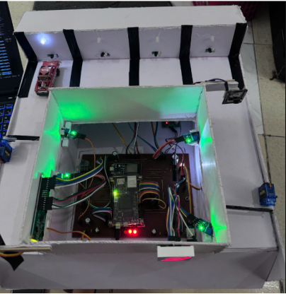

---

## 🏗 System Architecture

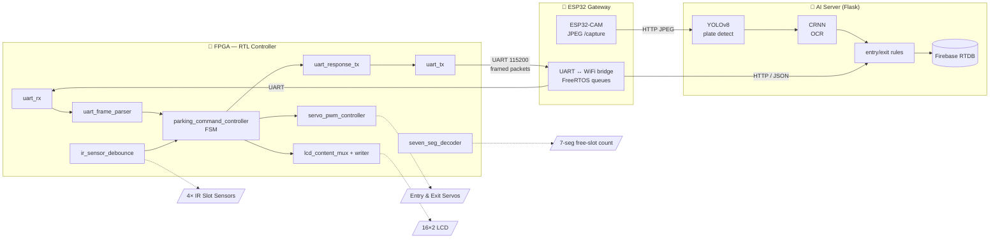

| Subsystem | Hardware it owns |
|-----------|------------------|
| FPGA | Entry/exit gate servos, 4 slot IR sensors + 4 barrier IR sensors, 2 failsafe buttons, 16×2 HD44780 LCD, 7-segment display, status LEDs |
| ESP32 | WiFi bridge, ESP32-CAM (entry + exit) |
| Server | YOLOv8 + CRNN models, Firebase Realtime Database |

---

## 🔁 End-to-End Flow

**Vehicle entry:**

```text
Car approaches → barrier IR fires → FPGA sends GATE_EVENT over UART
   → ESP32 triggers entry ESP32-CAM → POST /trigger to AI server
   → YOLOv8 finds the plate → CRNN reads it → server checks free slots + duplicates
   → server replies {action: open_entry} → ESP32 sends OPEN_GATE to FPGA
   → servo_pwm_controller swings the entry gate → LCD + 7-seg update → Firebase logs the event
```

The FPGA also continuously pushes `PARKING_STATUS` (slot bitmask) to the ESP32, which forwards changes to the server so the Firebase dashboard always shows live occupancy.

---

## 🔧 FPGA — RTL Design

> **This is the core of the project.** All RTL is hand-written, parameterized, and verified with dedicated testbenches.

**Target board:** MicroPhase Artyx A7 Lite 35T — Xilinx **Artix-7 XC7A35T**, 50 MHz system clock, LVCMOS33 I/O. Full pin mapping in [`FPGA/constraints/parking_uart_top.xdc`](FPGA/constraints/parking_uart_top.xdc).

**Toolchain:** Xilinx Vivado (synthesis & implementation), Questa / ModelSim (local simulation + waveforms), Icarus Verilog (CI simulation).

### RTL Modules

| Module | Role | Highlights |
|--------|------|-----------|
| `uart_rx` | UART receiver | 16× oversampling, parametrizable FIFO, parity / framing / overflow error flags, start-bit glitch rejection |
| `uart_tx` | UART transmitter | 8N1, LSB-first, 115200 baud, `busy`/`done` handshake |
| `uart_frame_parser` | Command frame decoder | Parses `[0xAA \| CMD \| LEN \| PAYLOAD \| XOR]`, checksum + timeout-based frame-error detection |
| `uart_response_tx` | Response builder | Assembles & serializes ACK/NACK/event frames back to the ESP32 |
| `parking_command_controller` | **Main control FSM** | Gate open/close dispatch, slot accounting, IR-event + failsafe handling, LCD message generation |
| `servo_pwm_controller` | Servo driver | 50 Hz PWM, independent entry/exit channels, open/close pulse widths |
| `ir_sensor_debounce` | Sensor conditioning | 2-stage synchronizer + N-cycle majority debounce, reused for slot / barrier / button inputs |
| `lcd_hd44780` | LCD driver | HD44780 4-bit mode, init sequence + nibble timing + enable pulse |
| `lcd_string_writer` | String writer | Writes 16-char line0/line1 with busy-wait handshaking |
| `lcd_content_mux` | Display selector | Welcome / slot-count / custom-message muxing with a hold timer |
| `seven_seg_decoder` | BCD → 7-seg | Combinational decode of the free-slot count |
| `parking_uart_top` | **Top-level integration** | Wires every submodule, adds power-on reset, alive/error LEDs, free-slot counting |

**Module hierarchy (Vivado RTL schematic):**


### Design features worth noting

- **Fully parameterized** — clock frequency, baud, oversampling, FIFO depth, slot count and debounce/timeout windows are all `parameter`s on `parking_uart_top`.
- **Clean clock-domain hygiene** — every async input (UART RX, IR sensors, buttons) passes through a 2-stage synchronizer before use.
- **Robust link layer** — XOR checksum, framing/parity/overflow detection, and a frame-timeout guard against partial frames.
- **Safety** — hardware failsafe buttons open the gates directly through the FSM; a power-on-reset holds the design in reset for the first 16 clocks.

### Implementation Results

Synthesized, placed & routed in Vivado for the Artix-7 **XC7A35T** at 50 MHz — **timing closed with positive slack and zero failing endpoints**.

| Metric | Value |
|--------|-------|
| Slice LUTs | 825 / 20,800 (~4%) |
| Slice Registers (FF) | 1,598 / 41,600 (~4%) |
| Occupied Slices | 433 / 8,150 (~5%) |
| Bonded IOB | 42 / 250 (~17%) |
| Global Clock Buffers | 1 / 32 |
| Worst Negative Slack (WNS) | **+10.653 ns** |
| Failing endpoints | **0 / 4,445** |
| Max achievable clock | **≈ 107 MHz** (from positive slack at 50 MHz) |
| Timing | ✅ All user-specified timing constraints met |


> Full implementation report — synthesized schematic, device view, utilization & timing — is in [`FPGA/README.md`](FPGA/README.md).

---

## 📡 UART Command Protocol

A compact **length-prefixed framed protocol** runs at 115200 baud between the ESP32 and FPGA, in both directions:

```text
┌──────┬─────────┬─────────┬──────────────┬──────────────┐
│ 0xAA │   CMD   │   LEN   │   PAYLOAD…   │ XOR CHECKSUM │
│ SYNC │ 1 byte  │ 1 byte  │  LEN bytes   │   1 byte     │
└──────┴─────────┴─────────┴──────────────┴──────────────┘
        └──────────── XOR over CMD, LEN & payload ───────┘
```

`LEN` is the payload length (0–16 bytes); the checksum is the XOR of the `CMD`, `LEN`, and every payload byte. The parser enforces `LEN ≤ MAX_PAYLOAD` and a frame-timeout guard against truncated frames.

**Host → FPGA commands**

| CMD | Name | Meaning |
|-----|------|---------|
| `0x01` | `OPEN_GATE` | Open entry/exit gate (payload selects gate) |
| `0x02` | `CLOSE_GATE` | Close gate |
| `0x05` | `REQUEST_STATUS` | Request current slot bitmask |
| `0x06` / `0x07` | `LCD_LINE0/1` | Push a custom LCD string |
| `0x7F` | `PING` | Liveness check |

**FPGA → Host responses**

| CMD | Name | Meaning |
|-----|------|---------|
| `0x10` | `PARKING_STATUS` | Slot-occupancy bitmask |
| `0x11` | `GATE_EVENT` | A barrier IR sensor fired |
| `0x12` | `FAILSAFE_EVENT` | Manual failsafe button opened a gate |
| `0x80` / `0x81` | `ACK` / `NACK` | Command accepted / rejected (with error code) |
| `0x82` | `PONG` | Reply to `PING` |

---

## 🧪 Simulation & Verification

Every RTL module has a **self-checking SystemVerilog testbench**, and every run is captured as a Questa waveform. Full annotated gallery: [`docs/waveform/README.md`](docs/waveform/README.md).

```bash
cd FPGA/scripts

make sim  TOP=tb_parking_uart_top   # run a testbench (batch)
make wave TOP=tb_parking_uart_top   # open the waveform viewer
```

### Top-level integration waveform — `parking_uart_top`

End-to-end: UART RX → frame parser → command FSM → servo PWM + LCD → UART TX response.

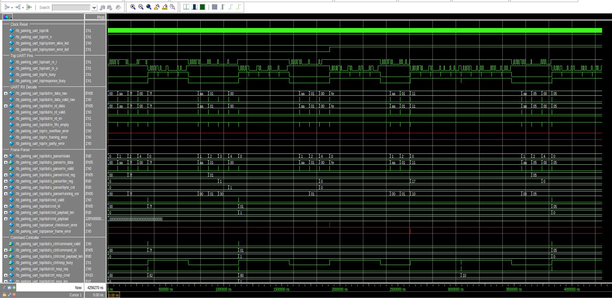

<details>
<summary>📈 More waveforms (click to expand)</summary>

**UART receive (16× oversampling, FIFO, error flags)**
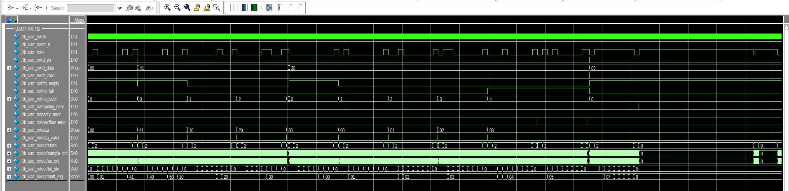

**Command frame parser (checksum / frame-error)**
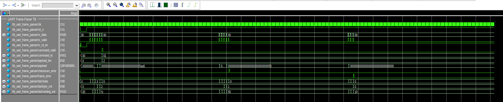

**Parking command controller FSM**
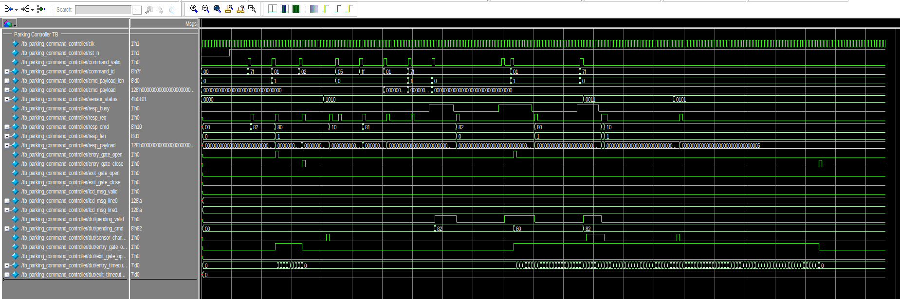

**Servo PWM (50 Hz, open/close pulse widths)**
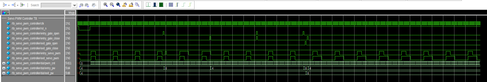

**IR sensor debounce (sync + majority filter)**
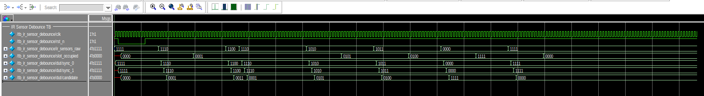

**HD44780 LCD driver**
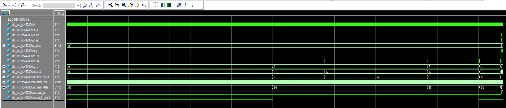

</details>

| Module | Testbench | Coverage focus |
|--------|-----------|----------------|
| `uart_rx` | `tb_uart_rx.sv` | 6 cases: normal RX, back-to-back, FIFO overflow, framing error, parity, glitch rejection |
| `uart_tx` | `tb_uart_tx.sv` | Single + back-to-back TX, busy/done timing |
| `uart_frame_parser` | `tb_uart_frame_parser.sv` | Valid frames, checksum mismatch, incomplete frame |
| `uart_response_tx` | `tb_uart_response_tx.sv` | ACK/NACK build, back-to-back, checksum |
| `parking_command_controller` | `tb_parking_command_controller.sv` | Full-slot reject, invalid cmd, concurrent entry/exit |
| `parking_uart_top` | `tb_parking_uart_top.sv` | Full system integration |
| `servo_pwm_controller` | `tb_servo_pwm_controller.sv` | Open/closed pulse widths, transitions |
| `ir_sensor_debounce` | `tb_ir_sensor_debounce.sv` | Glitch rejection, stable transitions |
| `lcd_hd44780` | `tb_lcd_hd44780.sv` | Init sequence, nibble timing |
| `lcd_string_writer` | `tb_lcd_string_writer.sv` | Sequential char write, handshaking |
| `lcd_content_mux` | `tb_lcd_content_mux.sv` | Content select, message hold timer |
| `seven_seg_decoder` | `tb_seven_seg_decoder.sv` | All 16 inputs vs. truth table |

---

## 📟 ESP32 Gateway & Camera

**Toolchain:** PlatformIO (Arduino-ESP32).

- **`ESP32_firmware`** — the gateway. Runs a FreeRTOS HTTP-worker task with request/response queues so UART servicing never blocks on network calls. Parses framed UART from the FPGA, forwards gate events to the server, relays slot updates, and drives a status LCD.
- **`ESP_CAM_firmware`** — exposes `GET /capture` returning a VGA JPEG, with rate-limiting, busy-guard, and auto camera/WiFi recovery.

```bash
cd ESP32/ESP32_firmware && pio run --target upload
cd ESP32/ESP_CAM_firmware && pio run --target upload
```

> ⚙️ Copy `include/config.h` and fill in your WiFi SSID/password and `SERVER_BASE_URL` before flashing.

---

## 🧠 AI Server

**Pipeline:** ESP32-CAM JPEG → **YOLOv8** plate detection → crop + preprocess → **CRNN** (CNN + BiLSTM, CTC decode) OCR → plate normalization → entry/exit rule check → Firebase log.

- **Detection:** Ultralytics YOLOv8 fine-tuned for license plates.
- **OCR:** Custom CRNN trained with a CTC loss over a Vietnamese-plate charset (digits + plate letters) with domain post-processing (letter/digit disambiguation, plate formatting `XXX-NNN.NN`).
- **Server:** Flask with `/trigger` (gate decision) and `/update_slots` (occupancy sync), thread-safe in-memory plate registry, OCR timeout guard, atomic capture writes.
- **Realtime:** pushes `/logs`, `/vehicles/{plate}`, `/realtime`, `/slot_detail` to Firebase RTDB.

### Setup

```bash
cd SERVER_AI
pip install -r requirements.txt
cp config/firebase_key.example.json config/firebase_key.json   # add your service-account key

# Camera IPs + Firebase URL are read from environment variables
# (see .env.example for the names). Export them, e.g.:
export ENTRY_CAM_URL=http://192.168.1.10/capture
export EXIT_CAM_URL=http://192.168.1.11/capture
export FIREBASE_DATABASE_URL=https://your-project-id-default-rtdb.firebaseio.com/
```

Download model weights from [Releases](https://github.com/vohoangnguyennnn/smart-parking-fpga-AI/releases/tag/v1.0-models):

```bash
wget https://github.com/vohoangnguyennnn/smart-parking-fpga-AI/releases/download/v1.0-models/license_plate_best.pt -P models/yolo/
wget https://github.com/vohoangnguyennnn/smart-parking-fpga-AI/releases/download/v1.0-models/best_crnn.pth        -P models/crnn/
```

### Run

```bash
python server/server.py                  # Flask server on :5000
python -m ai.plate_recognition           # debug: run detection on sample_images/
```

**Live Firebase dashboard:**

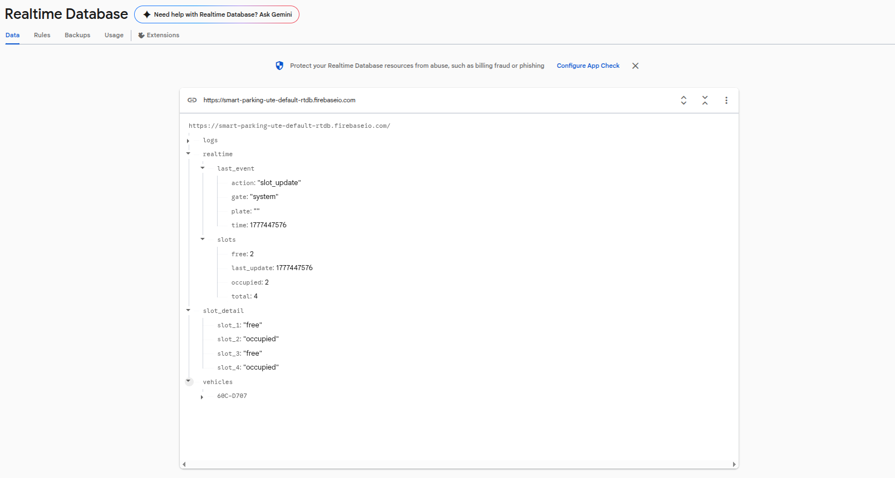

**YOLO + CRNN plate recognition demo:**

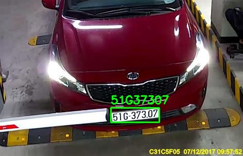

---

## 📂 Repository Structure

```text
smart-parking-fpga-AI/
├── FPGA/
│   ├── rtl/            # 12 Verilog RTL modules
│   ├── tb/             # 12 SystemVerilog testbenches
│   ├── scripts/        # Makefile, wave.do (Questa)
│   └── constraints/    # Vivado XDC pin constraints
├── ESP32/
│   ├── ESP32_firmware/     # UART↔WiFi gateway (PlatformIO)
│   └── ESP_CAM_firmware/   # ESP32-CAM capture server
├── SERVER_AI/
│   ├── ai/             # plate_recognition.py, train_yolo.py, train_crnn.py
│   ├── server/         # Flask server
│   └── models/         # YOLO + CRNN weights (via Releases)
├── docs/waveform/      # Questa waveform gallery (PNG)
└── .github/workflows/  # CI: RTL lint + sim, ESP32 build
```

---

## 🚀 Getting Started

```bash
git clone https://github.com/vohoangnguyennnn/smart-parking-fpga-AI.git
cd smart-parking-fpga-AI

# 1. Simulate the RTL (needs Questa/ModelSim)
cd FPGA/scripts && make sim TOP=tb_parking_uart_top

# 2. Build ESP32 firmware (needs PlatformIO)
cd ../../ESP32/ESP32_firmware && pio run

# 3. Run the AI server (needs Python 3.10+)
cd ../../SERVER_AI && pip install -r requirements.txt && python server/server.py
```

---

## ⚙️ Continuous Integration

GitHub Actions runs automatically on changes to each subsystem:

- 🧹 **RTL syntax check** — Icarus Verilog compiles all RTL modules together
- 🌊 **RTL simulation (smoke tests)** — Icarus Verilog (`iverilog` + `vvp`) runs the portable subset of self-checking testbenches and asserts `ALL TESTS PASSED`
- 🔨 **ESP32 build** — PlatformIO compiles both the gateway and ESP-CAM firmwares

> **Full functional sign-off is done in Questa/ModelSim** (the waveform gallery is the record of that). CI uses the open-source Icarus Verilog as a smoke test so it runs without licensed tools; a few testbenches rely on SystemVerilog features Icarus doesn't support and are therefore verified only in Questa.

---

## 🛠 Tech Stack

**Hardware / RTL:** Verilog, SystemVerilog, Xilinx Vivado, Questa/ModelSim, Icarus Verilog
**Embedded:** ESP32, ESP32-CAM, C++, PlatformIO, FreeRTOS
**AI / Backend:** Python, PyTorch, Ultralytics YOLOv8, CRNN (CTC), Flask, OpenCV
**Cloud:** Firebase Realtime Database
**Tooling:** GitHub Actions CI, Make

---

## 📄 License

MIT — see [LICENSE](LICENSE).
