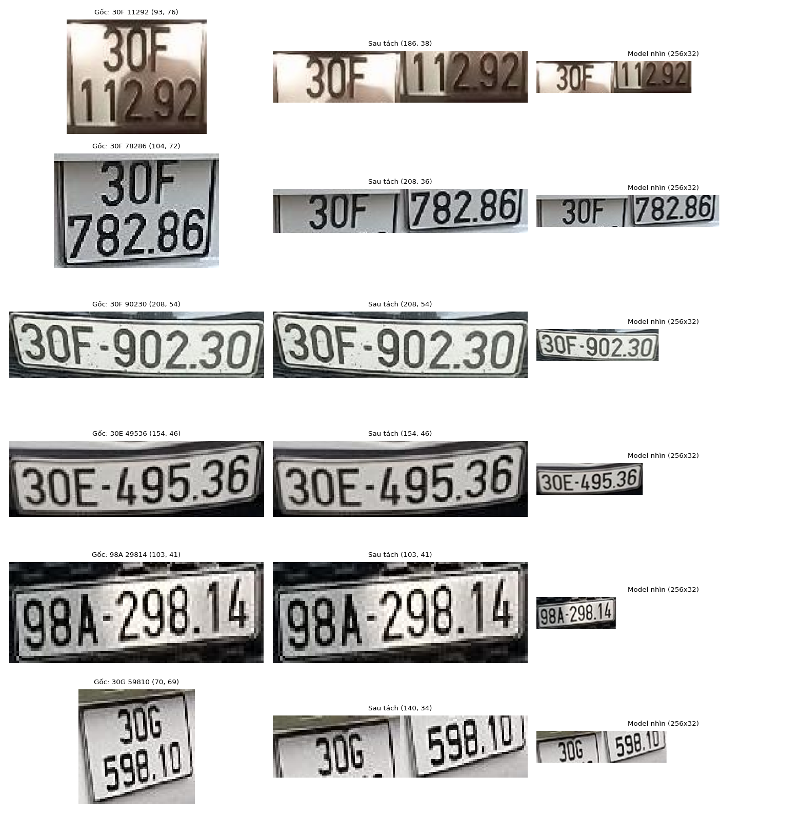
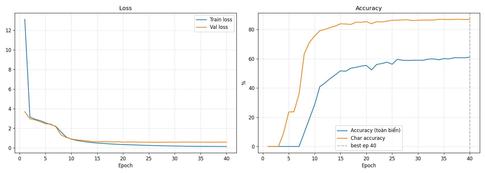
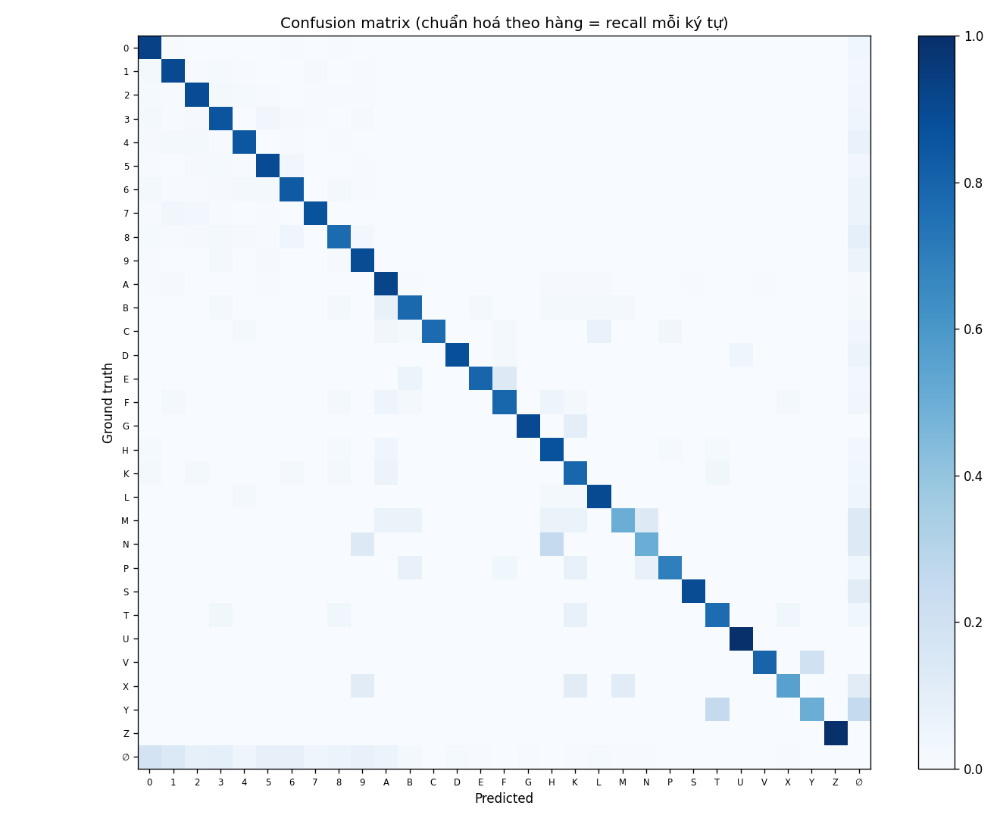

# AI Server — License Plate Recognition

Flask backend that reads license plates from ESP32-CAM images and drives the parking gate decisions. Detection uses **YOLOv8**, OCR uses a custom **CRNN** (CNN + BiLSTM, CTC), and all events are logged to **Firebase Realtime Database**.

> See the [top-level README](../README.md) for the full system (FPGA + ESP32 + AI server).

---

## Pipeline

```text
ESP32-CAM JPEG → YOLOv8 (plate detect) → crop + preprocess
  → CRNN (CTC decode) → cleanup + validation → entry/exit rule check → Firebase log
```

- **Detection:** Ultralytics YOLOv8 fine-tuned for license plates (`models/yolo/license_plate_best.pt`).
- **OCR:** Custom CRNN over a Vietnamese-plate charset (digits + plate letters), trained with CTC loss (`models/crnn/best_crnn.pth`).
- **Pre/post-processing:** near-square two-line plates are split and stitched into one OCR line, decoded text is cleaned to `A-Z0-9`, then the server validates the Vietnamese plate shape before opening the gate.



---

## Directory Layout

```text
SERVER_AI/
├── ai/
│   ├── plate_recognition.py   # YOLO + CRNN inference (detect_plate())
│   ├── train_yolo.py          # YOLOv8 training
│   └── train_crnn.py          # CRNN training
├── server/
│   └── server.py              # Flask app
├── config/
│   └── firebase_key.example.json
├── dataset/                   # data.yaml.example (training data goes here)
├── models/                    # YOLO + CRNN weights (via Releases)
├── sample_images/             # test images for debug runs
├── .env.example
└── requirements.txt
```

---

## Setup

Run the commands below from `SERVER_AI/`.

```bash
pip install -r requirements.txt

# Firebase service-account key
cp config/firebase_key.example.json config/firebase_key.json   # then paste your key

# Camera IPs + Firebase URL are read from environment variables
# (.env.example lists the names). Export them, e.g.:
export ENTRY_CAM_URL=http://192.168.1.10/capture
export EXIT_CAM_URL=http://192.168.1.11/capture
export FIREBASE_DATABASE_URL=https://your-project-id-default-rtdb.firebaseio.com/
```

Download model weights from [Releases](https://github.com/vohoangnguyennnn/smart-parking-fpga-AI/releases/tag/v1.0-models):

```bash
wget https://github.com/vohoangnguyennnn/smart-parking-fpga-AI/releases/download/v1.0-models/license_plate_best.pt -P models/yolo/
wget https://github.com/vohoangnguyennnn/smart-parking-fpga-AI/releases/download/v1.0-models/best_crnn.pth        -P models/crnn/
```

> Requires Python 3.10+. CUDA is used automatically if available, otherwise it falls back to CPU.

---

## Run

```bash
python server/server.py          # Flask server on :5000
python -m ai.plate_recognition   # debug: run detection on sample_images/ → outputs/
```

---

## HTTP API

| Method | Route | Body | Purpose |
|--------|-------|------|---------|
| `GET` | `/` | — | Health check (status, slot count, cameras) |
| `POST` | `/trigger` | `{ "gate": "entry"\|"exit", "slot_mask": int }` | Capture → OCR → gate decision |
| `POST` | `/update_slots` | `{ "slot_mask": int }` | Log slot occupancy (no gate action) |

`/trigger` response: `{ "status", "plate", "action", "elapsed" }` where `action` is `open_entry` / `open_exit` / `reject`.

**Gate rules:**
- **Entry** — rejected if no free slots, OCR fails, the plate format is invalid, or the plate is already inside (duplicate).
- **Exit** — rejected if OCR fails or the plate has no matching `IN` record; a unique one-character OCR mismatch is tolerated for exit matching.
- **Restart recovery** — on startup, the server restores currently parked (`IN`) vehicles from Firebase so exit decisions survive server restarts.

---

## Firebase Schema

| Path | Contents |
|------|----------|
| `/logs` | Append-only IN/OUT event log (plate, gate, action, time) |
| `/vehicles/{plate}` | Per-vehicle status (`IN`/`OUT`, last_seen) |
| `/realtime` | Live slot counts + last event |
| `/slot_detail` | Per-slot `occupied`/`free` labels |

---

## Training

```bash
python ai/train_yolo.py    # fine-tune YOLOv8 detector (configure dataset/data.yaml)
python ai/train_crnn.py    # train the CRNN OCR model
```

Copy `dataset/data.yaml.example` to `dataset/data.yaml` and point it at your dataset before training the detector.

### YOLOv8 detector

| Setting | Value |
|---------|-------|
| Base model | YOLOv8n (nano) |
| Epochs | 30 (early-stop patience 25) |
| Image size | 640 × 640 |
| Batch size | 8 |
| Precision | AMP (mixed precision) |
| Trained on | RTX 3050 4 GB |

### CRNN OCR

| Setting | Value |
|---------|-------|
| Architecture | 5× CNN blocks + 2-layer BiLSTM (hidden 384) + CTC head |
| Input | 32 × 256 grayscale |
| Charset | 30 plate characters + CTC blank |
| Epochs | 40 (early-stop patience 8) |
| Batch size | 256 |
| Optimizer | AdamW (lr 3e-4, weight decay 3e-4) |
| LR schedule | OneCycleLR |
| Loss | CTC |
| Dataset | Kaggle: `vietnamese-license-plate-ocr` (real cropped validation + generated training samples) |

### Results

The CRNN evaluation below is from `../docs/AI/results/eval_metrics.json` on a real cropped validation split.

| Metric | Value |
|--------|-------|
| Validation samples | 624 |
| Full-plate exact match | 61.06% |
| Length match | 85.90% |
| Character accuracy | 85.91% |
| Aligned character accuracy | 84.38% |
| Mean edit distance | 1.143 |
| Macro F1 | 0.8122 |
| Weighted F1 | 0.8758 |
| Cohen's kappa | 0.83 |





Detailed artifacts are kept in `docs/AI/results/`:

- `eval_metrics.json` — headline validation metrics
- `classification_report.csv` — per-character precision/recall/F1
- `confusion_matrix.png` — character-level confusion matrix
- `top_confusions.csv` — most frequent character confusions
- `per_position_accuracy.csv` — accuracy by plate-character position
