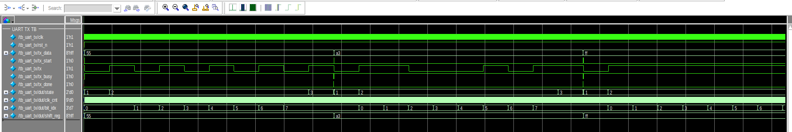
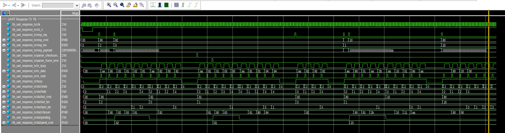
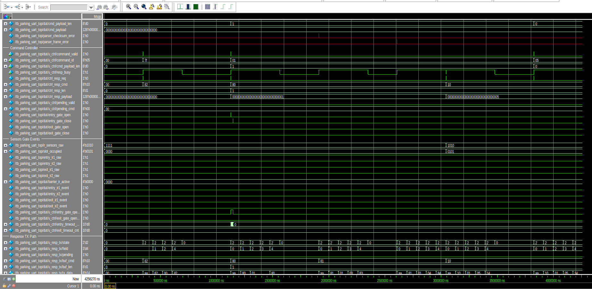
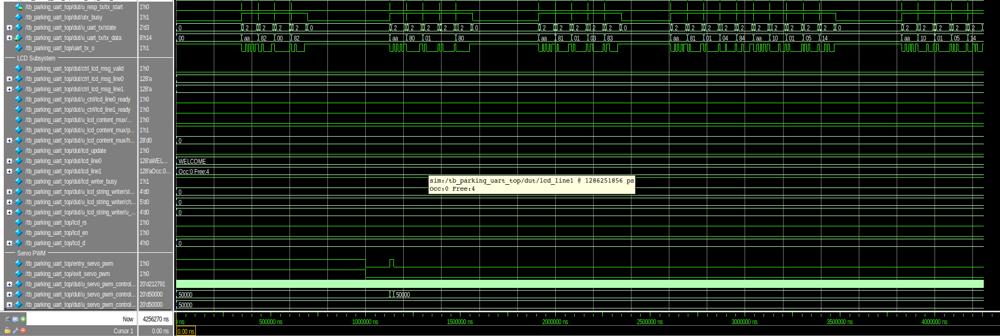
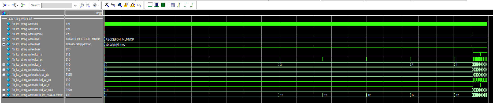
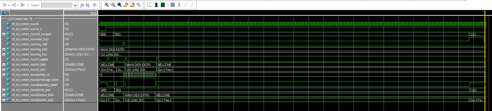
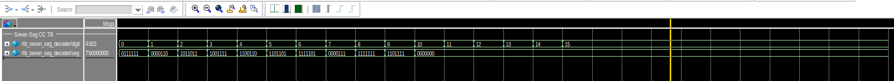

# Simulation Waveforms

This directory contains Questa waveform screenshots for each RTL module in the Smart Parking FPGA project.

Waveforms are captured by running `make wave TOP=<testbench>` from `FPGA/scripts/`.

---

## UART

### `uart_rx` — UART Receive

**Testbench:** `tb_uart_rx.sv` | **Tests:** 6 test cases

Verifies 16× oversampling reception with a FIFO buffer. Tests cover: normal byte reception,
back-to-back frames with FIFO read-back, FIFO overflow protection, framing error on bad stop bit,
even parity pass/fail, and start-bit glitch rejection.

**Key signals:** `rx`, `data_valid`, `fifo_level`, `fifo_full`, `framing_error`, `parity_error`, `overflow_error`


---

### `uart_tx` — UART Transmit

**Testbench:** `tb_uart_tx.sv`

Verifies 8N1 serial transmission LSB-first at 115200 baud. Tests single-byte and back-to-back
transmission, `busy` flag assertion during transmission, and `done` pulse on completion.

**Key signals:** `tx_data`, `tx_start`, `tx`, `busy`, `done`



---

### `uart_frame_parser` — Command Frame Parser

**Testbench:** `tb_uart_frame_parser.sv`

Verifies parsing of the 4-byte command frame `[0xAA | CMD | PAYLOAD | XOR_CHECKSUM]` streamed
from the UART RX FIFO. Tests valid frames, checksum mismatch detection, and incomplete frame
(frame error) handling.

**Key signals:** `rx_data`, `rx_valid`, `command_valid`, `command_id`, `payload`, `checksum_error`, `frame_error`


---

### `uart_response_tx` — ACK/NACK Response Transmitter

**Testbench:** `tb_uart_response_tx.sv`

Verifies construction and serial transmission of the response frame
`[0xAA | CMD | STATUS | PAYLOAD... | XOR_CHECKSUM]` back to the ESP32. Tests ACK/NACK for
multiple command types, back-to-back responses, and checksum correctness.

**Key signals:** `resp_req`, `resp_cmd`, `resp_len`, `resp_payload`, `tx_data`, `tx_busy`



---

## Parking Control

### `parking_command_controller` — Gate Control FSM

**Testbench:** `tb_parking_command_controller.sv`

Verifies the main control FSM that dispatches gate OPEN/CLOSE commands to entry/exit servos
based on decoded UART commands and IR sensor status. Tests full slot rejection, invalid command
handling, and concurrent entry/exit requests.

**Key signals:** `command_valid`, `command_id`, `sensor_status`, `entry_gate_open`, `exit_gate_open`, `resp_req`, `resp_cmd`


---

### `parking_uart_top` — Top-Level Integration

**Testbench:** `tb_parking_uart_top.sv`

End-to-end integration test of the full system: UART RX → frame parser → command controller →
servo PWM + LCD display → UART TX response. Verifies correct signal flow across all submodules
under realistic command sequences from the ESP32.

#### Part 1 — UART RX, IR sensors, gate control, parking slot status


#### Part 2 — Parking command controller, slot occupancy, servo, LCD control signals



#### Part 3 — UART TX, LCD subsystem (line0/line1, string writer), Servo PWM counters



---

## Actuators

### `servo_pwm_controller` — 50 Hz PWM Servo Driver

**Testbench:** `tb_servo_pwm_controller.sv`

Verifies generation of a 50 Hz PWM signal with configurable pulse width for two independent
servo channels (entry gate, exit gate). Tests open position (≈2 ms pulse), closed position
(≈1 ms pulse), and transition timing.

**Key signals:** `entry_gate_open`, `entry_gate_close`, `exit_gate_open`, `exit_gate_close`, `entry_servo_pwm`, `exit_servo_pwm`


---

### `ir_sensor_debounce` — IR Vehicle Detection Debounce

**Testbench:** `tb_ir_sensor_debounce.sv`

Verifies a 2-stage synchronizer + N-cycle majority debounce for 4 IR sensor channels.
Tests glitch rejection on pulses shorter than the debounce window and correct stable output
for valid transitions.

**Key signals:** `ir_sensors_raw`, `slot_occupied`, `dut/sync_0`, `dut/sync_1`, `dut/candidate`


---

## Display

### `lcd_hd44780` — HD44780 LCD Driver (4-bit mode)

**Testbench:** `tb_lcd_hd44780.sv`

Verifies the low-level HD44780 driver: initialization sequence (function set, display on,
entry mode), single character write, and command write with correct 4-bit nibble timing and
enable pulse generation.

**Key signals:** `wr_en`, `wr_rs`, `wr_data`, `lcd_rs`, `lcd_en`, `lcd_d`, `busy`


---

### `lcd_string_writer` — Sequential String Writer

**Testbench:** `tb_lcd_string_writer.sv`

Verifies sequential write of a 16-character string to LCD line 0 and line 1 by iterating
through each character index and driving the HD44780 driver. Tests update trigger and
busy-wait handshaking.

**Key signals:** `update`, `line0`, `line1`, `lcd_rs`, `lcd_en`, `lcd_d`, `dut/char_idx`, `dut/state`



---

### `lcd_content_mux` — Display Content Multiplexer

**Testbench:** `tb_lcd_content_mux.sv`

Verifies selection of display content (WELCOME screen, slot count, custom message) based on
system state and `slot_occupied` bitmap. Tests message override with hold timer and
automatic revert to slot status after timeout.

**Key signals:** `slot_occupied`, `msg_valid`, `msg_line0/1`, `lcd_line0/1`, `lcd_update`, `dut/message_active`



---

### `seven_seg_decoder` — BCD to 7-Segment Decoder

**Testbench:** `tb_seven_seg_decoder.sv`

Verifies combinational decoding of a 4-bit BCD digit (0–9) to the correct 7-segment pattern.
Sweeps all 16 input values and checks each segment output against the expected truth table.

**Key signals:** `digit`, `seg`



---

## How to Capture Waveforms

```bash
cd FPGA/scripts

make wave TOP=tb_uart_rx
make wave TOP=tb_uart_tx
make wave TOP=tb_uart_frame_parser
make wave TOP=tb_uart_response_tx
make wave TOP=tb_parking_command_controller
make wave TOP=tb_parking_uart_top
make wave TOP=tb_servo_pwm_controller
make wave TOP=tb_ir_sensor_debounce
make wave TOP=tb_lcd_hd44780
make wave TOP=tb_lcd_string_writer
make wave TOP=tb_lcd_content_mux
make wave TOP=tb_seven_seg_decoder
```
